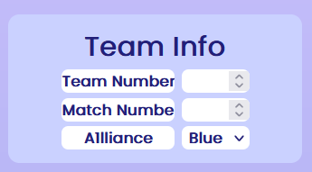
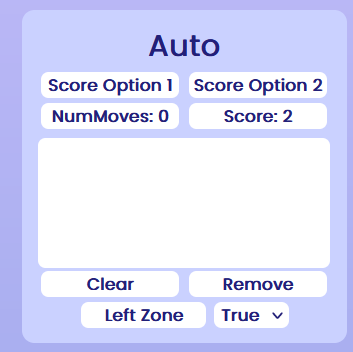
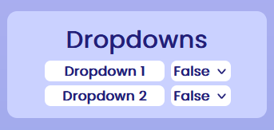
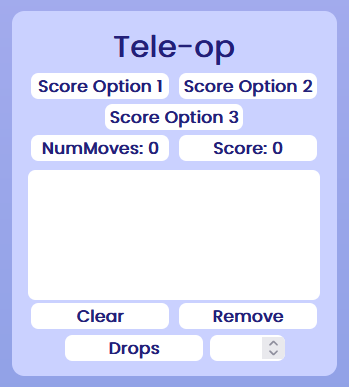
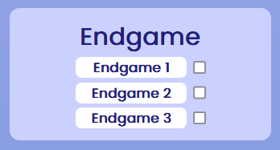
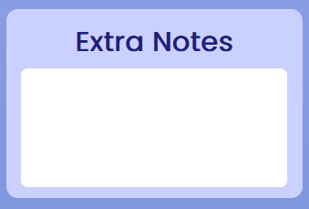
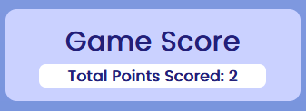

This is an FRC scouting app [EmilioMGithub](https://github.com/EmilioMGithub) and I made.

It uses the [QRCodeJS](https://davidshimjs.github.io/qrcodejs/) library to generate QR codes that are then scanned by another  
(iOS) app and submitted to our database, avoiding having to deal with browser security.  

---

<h1> How it is used </h1>

This site consists of a variety of input options. Here they are, as well as how they  
were used for the 2024 season.

## 1. Team number, match, and alliance input

These are the inputs for essential info about the robot. They probably shouldn't be removed.

## 2. Auto scoring

The input set for auto scores. Also has a true/false dropdown that can be used. In the 2024  
season these 2 input options were speaker and amp for score options 1 and 2 respectively.  
The true/false dropdown was used for the robot leaving its starting zone.

## 3. Dropdowns

A set of two dropdowns. In the 2024 season these were used for co-oopertition, with dropdowns 1  
and 2 being for offering co-op and doing co-op respectively.

## 4. Tele-op scoring

The input set for tele-op scores. Also has a number input that can be used. In the 2024  
season these 3 input options were speaker, amp, and amped speaker for score options 1,2, and 3   
respectively. The number input was used for the number of times the bot dropped a note.

## 5. Endgame

A set of 3 checkboxes for endgame actions. These were used for human player actions in 2024.

## 6. Extra notes

A big text input. This was used in 2024 for other stuff the scouter wanted to say about the bot.

## 7. Match score

The calculated match score for the robot.

---

  
<h1>QR Codes</h1>

## The library and generator function
QR code handling is done by the QRCodeJS library, as mentioned before. The GenerateQRCode  
function in MatchScouting.js takes all inputs from the page and converts them into a JSON  
string. It then creates a QR code with that JSON data, which is then displayed on the page.  
## Making it work for you
All of the keys and values can and should be changed to fit your implementation. 

